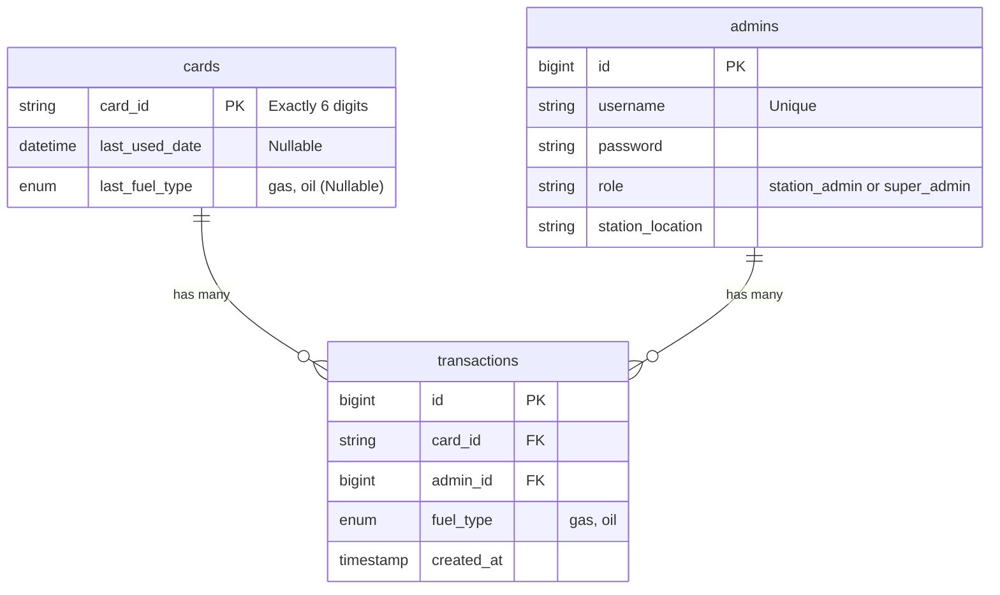

# Fuel Rationing System - Living Design Document

> **AGENT INSTRUCTION:** This is a living document. Read this before starting any task. After completing a task, update the relevant sections below and add an entry to the Implementation Changelog.

## 1. Project Vision & Core Logic
*   **Goal:** Distribute subsidized Gas (Gasoline/LPG: Kurdish "گاز", Arabic "غاز") and Oil (Petrol/Benzine: Kurdish "بەنزین", Arabic "بنزين") securely.
*   **Card System:** 6-digit physical ID cards.
*   **The 7-Day Rule:** A card can be used for either Gas or Oil. Once used, it is locked for exactly 7 days. If queried during cooldown, the system returns the exact days remaining.

## 2. Current Tech Stack
*   **Backend:** Laravel (PHP 8.5), MySQL
*   **Frontend:** React, TypeScript, Tailwind CSS v4 (using `@tailwindcss/vite`), react-i18next
*   **Mobile:** Native Android / Java (Handled manually)

### Frontend Architecture & Shared Components
*   `src/components/common/ConfirmationModal.tsx`: Reusable dark glassmorphic confirmation modal featuring keyboard listener for Escape key, click-outside overlay dismissal, warning icon, and localized action buttons. Replaces legacy browser `window.confirm()` dialogs across Super Admin views.
*   `src/components/AdminPanel.tsx`: Unified dashboard handling fuel dispensing for Station Admins and admin/card management tabs for Super Admins.
*   `src/components/UserPanel.tsx`: Public portal for citizens to query 6-digit card rationing status and remaining cooldown days.

## 3. Testing Credentials & Admin Access
*   **Super Admin:** `superadmin` / `superpassword123` / `Headquarters` (Role: `super_admin`)
*   **Station Admin:** `admin` / `password123` / `Kirkuk Central Station` (Role: `station_admin`)
*   **Admin Seeder:** Created `database/seeders/AdminSeeder.php` utilizing `Admin::updateOrCreate()`.
*   **Database Inspection Command:** Run `php artisan app:inspect-db` to view total cards count, registered administrators, and total logged transactions.

## 4. Database Schema (Living State)
*   `cards`: `card_id` (PK, string, 6-char), `last_used_date` (datetime, nullable), `last_fuel_type` (enum: gas, oil, nullable)
    *   **Note:** The `card_id` primary key is explicitly enforced as a string (with `incrementing = false` and `keyType = 'string'` in the Model). Queries to this table must treat `card_id` as a padded 6-character string (e.g. `"000000"`) to prevent integer casting issues.
*   `admins`: `id`, `username`, `password`, `role` (enum/string: `station_admin`, `super_admin`), `station_location`
    *   **Role Permissions:**
        *   `super_admin`: Executive role for Headquarters. Can Manage Admins and Issue/View Cards. (Cannot dispense fuel).
        *   `station_admin`: Operational role for local stations. Can Check Card Status and Dispense Fuel. (Cannot manage admins or cards).
*   `transactions`: `id`, `card_id` (FK), `admin_id` (FK), `fuel_type` (enum: gas, oil), `created_at`

### Database Seeding Strategy
A high-performance Artisan command (`php artisan db:seed-cards`) was created to bulk-insert all 1,000,000 possible 6-digit combinations (000000 to 999999). To prevent memory exhaustion and execution timeouts, the script executes chunked inserts of 10,000 records per query, utilizing `DB::table()->insert()` and disabling query logs for maximum throughput.

### Entity Relationship Diagram (ERD)
The database structure is governed by explicit foreign key constraints ensuring referential integrity between transactions, cards, and administrators.



## 5. Admin Panel Fuel Dispensing Workflow
1. Navigate to `/admin` or click "Admin Panel" (`admin_panel` translation key) in the Navbar.
2. Log in using station admin credentials.
3. Input a 6-digit `card_id` (e.g., `111111`).
4. Click either **Gas** (Kurdish: "گاز", Arabic: "غاز") or **Oil** (Kurdish: "بەنزین", Arabic: "بنزين") dispensing button.
5. Frontend sends request to `POST /api/transactions/process` with Sanctum Bearer token.
6. **Validation & Cooldown Check:** If the card was used within 7 days, an HTTP 403 response is returned with the remaining days. An error banner displays the precise days remaining and the exact calendar date of availability. Note: The 403 response is intentional for blocked cards.
7. **Success Path:** If eligible, a new transaction is logged, `last_used_date` is updated to `now()`, and a detailed success receipt with timestamp, station location, fuel type, and card ID is displayed.

## 6. Super Admin Management Workflow
1. Log in with `superadmin` / `superpassword123`.
2. The user is redirected to the main unified `AdminPanel.tsx` dashboard.
3. Because the user possesses the `super_admin` role, a special tab navigation bar appears at the top of the panel, revealing three sections:
   - **Dispense Fuel**: The standard fuel dispensing interface.
   - **Manage Admins**: A view to list all existing `station_admin` accounts, register new station admins by providing a username, password, and station location, and delete/revoke station admins.
   - **Card Management**: A view to issue new 6-digit physical cards, search for cards, and delete unused cards.
4. Protected API endpoints enforce the `super_admin` role via middleware for the management tabs.

## 7. API Endpoints (Living State)
*   `GET /api/cards/{card_id}/status` - Public check. Returns eligibility, cooldown days (ceiling integer), and exact available dates (`available_date`, `available_readable`).
*   `POST /api/login` - Authenticates admin and returns Sanctum Bearer token + Admin object (including `role`).
*   `POST /api/transactions/process` - Protected by Sanctum. Processes fuel and updates ledger. **(Restricted: Returns 403 if role is not `station_admin`)**.
*   `GET /api/super-admin/admins` - Protected (Super Admin only). Lists all station admins.
*   `POST /api/super-admin/admins` - Protected (Super Admin only). Creates a new station admin.
*   `DELETE /api/super-admin/admins/{admin}` - Protected (Super Admin only). Deletes a station admin.
*   `GET /api/super-admin/cards` - Protected (Super Admin only). Lists paginated cards with search and real-time status.
*   `POST /api/super-admin/cards` - Protected (Super Admin only). Issues a new 6-digit card.
*   `DELETE /api/super-admin/cards/{card_id}` - Protected (Super Admin only). Revokes a card if no transactions exist.

## 8. Local Development
*   **Runner Script:** A `run.bat` script is available in the project root. Double-click it to simultaneously start the Laravel backend and React frontend in separate command prompt windows.
*   **CORS Configuration:** The backend accepts cross-origin requests from both `http://localhost:5173` and `http://127.0.0.1:5173` with full credentials support. Stateful API middleware is enabled in `bootstrap/app.php` to handle React frontend preflight requests natively.

## 9. UI/UX & Localization (i18n) Rules
*   **Directional Chevron Mirroring in RTL:** Flex containers mirror button order automatically when `dir="rtl"`. However, SVG icons/chevrons retain their absolute rotation unless explicitly mirrored. All directional navigation icons (such as pagination chevrons `ChevronLeft` and `ChevronRight`) **MUST** include Tailwind's `rtl:rotate-180` class (e.g. `<ChevronLeft className="rtl:rotate-180" />`) so that visual arrows match the semantic reading direction (Next points left in RTL, Previous points right).

## 10. Implementation Changelog
*   [2026-09-06] Initialized project rules and living documentation.
*   [2026-09-06] Created Windows development runner script (`run.bat`).
*   [2026-09-06] Initialized Laravel project and configured database connection.
*   [2026-09-06] Created initial migrations, models, and relationships for cards, admins, and transactions.
*   [2026-09-06] Configured CORS settings for frontend communication and created DatabaseSeeder with test data.
*   [2026-09-06] Fixed 500 Internal Server Error: The error was caused by a routing mismatch where `routes/api.php` used empty closures instead of pointing to controllers. Additionally, extracted business logic into `FuelCooldownService` and injected it into `CardController` and `TransactionController` to resolve missing dependencies and comply with SOLID rules.
*   [2026-09-06] Created `php artisan db:seed-cards` command for high-performance chunked bulk insertion of 1,000,000 cards.
*   [2026-09-06] Resolved Tailwind v4 PostCSS compilation error by integrating `@tailwindcss/vite`, updating `vite.config.ts`, deleting legacy PostCSS configurations, and migrating `index.css` to the modern `@import "tailwindcss";` directive.
*   [2026-09-06] Added `admin_panel` and `user_panel` translation keys across English (`en`), Arabic (`ar`), and Kurdish (`ku`) dictionaries and localized the top Navbar in `App.tsx`.
*   [2026-09-06] Created `AdminSeeder.php` with default testing credentials (`admin` / `password123` / `Kirkuk Central Station`).
*   [2026-09-06] Implemented Artisan command `php artisan app:inspect-db` to report total cards, admins, and logged transactions.
*   [2026-09-06] Completed Admin Fuel Dispensing flow in `AdminPanel.tsx` supporting login, 6-digit card validation, Gas/Oil action buttons, remaining days error banner (403), and digital success receipt.
*   [2026-09-06] Updated fuel terminology across i18n dictionaries: Gas (EN: "Gas", AR: "غاز", KU: "گاز"), Oil (EN: "Oil", AR: "بنزين", KU: "بەنزین"). Updated UI components to dynamically consume these localized strings.
*   [2026-09-06] Improved fuel cooldown calculation in `FuelCooldownService` to use accurate ceiling rounding for remaining days and explicitly return `available_date` and `available_readable`.
*   [2026-09-06] Implemented Super Admin System: Added `role` column to `admins` table. Created `SuperAdminController` with index, store, and destroy actions protected by `super_admin` middleware. Built `SuperAdminPanel.tsx` UI and localized admin management keys.
*   [2026-09-06] Added Card Management feature to Super Admin Panel. Implemented `/api/super-admin/cards` endpoints for paginated fetching, searching, creating, and safely deleting physical cards. Added localized UI components in English, Arabic, and Kurdish.
*   [2026-09-06] Created comprehensive End-to-End Testing & QA Guide outlining data setup, cross-role execution flows, translation verification, and database state queries.
*   [2026-09-06] Fixed bug where card '000000' returned 404 by aggressively padding strings with `str_pad` in `CardController.php` and improving exact error mapping in `UserPanel.tsx` (differentiating 404, 403, and Network Errors).
*   [2026-09-06] Re-architected the frontend dashboard to unify the Super Admin and Station Admin workflows. Merged the `SuperAdminPanel.tsx` logic into `AdminPanel.tsx` utilizing a dynamic tab-based navigation bar (Dispense Fuel, Manage Admins, Card Management) that conditionally renders based on the authenticated user's role. Updated i18n dictionaries to support RTL translation for the new tabs.
*   [2026-09-06] Enforced strict role segregation: Removed the "Dispense Fuel" tab for `super_admin` in `AdminPanel.tsx` (making "Manage Admins" the default view) and added a backend guard in `TransactionController.php` to return a 403 error if a non-`station_admin` attempts to process a transaction.
*   [2026-09-06] Fixed pagination arrow directions and flow in RTL languages (Arabic & Kurdish) by adding Tailwind `rtl:rotate-180` to directional chevrons (`ChevronLeft` & `ChevronRight`) in `AdminPanel.tsx`. Enforced strict alignment between disabled button states and logical page flow.
*   [2026-09-06] Built `ConfirmationModal.tsx` reusable React component and replaced legacy `window.confirm()` browser dialogs for card and admin deletion in `AdminPanel.tsx`. Added i18n translation keys across English, Arabic, and Kurdish.
*   [2026-09-06] Fixed `ReferenceError: handleSearchCards is not defined` crash in `AdminPanel.tsx` by restoring `fetchCards`, `handleSearchCards`, and `handleIssueCard` functions and verifying all event handlers scope cleanly. Confirmed Card Management tab renders without unmounting.
*   [2026-09-06] Created comprehensive production `README.md` detailing architectural overview, 7-day rationing rules, tech stack specifications, port 3307 database configuration, automated and manual setup instructions, default pre-seeded credentials table, full API endpoint reference, and step-by-step end-to-end verification checklist.

## 11. End-to-End Testing & QA Guide

**Step 1: Test Data Setup**
To prepare a clean test environment, execute the following commands in the `backend` directory:
```bash
php artisan migrate:fresh
php artisan db:seed --class=AdminSeeder
```
*(This creates `superadmin` / `superpassword123` and `admin` / `password123`)*

**Step 2: End-to-End Execution Scenario**
*   **Step A: Super Admin Management**
    1. Log in via `/admin` using `superadmin` / `superpassword123`.
    2. Navigate to "Station Administrators" tab: Create a new admin (`station_erbil`, `pass1234`, `Erbil North Station`).
    3. Navigate to "Card Management" tab: Issue a new card with ID `888999`.
    4. Verify both entries successfully populate in the UI tables and database.
*   **Step B: Citizen Status Check (Eligible)**
    1. Navigate to the public User Panel (`/`).
    2. Enter card `888999` and submit.
    3. Verify the card status displays as "Never Used / Ready" with a green visual indicator.
*   **Step C: Station Admin Fuel Dispensing**
    1. Log out, then log back in as `station_erbil` / `pass1234`.
    2. Input card `888999`.
    3. Select **Oil** (بەنزین / بنزين) and submit the transaction.
    4. Verify the success confirmation receipt appears.
*   **Step D: Cooldown Enforcement & Date Formatting Verification**
    1. Return to the public User Panel.
    2. Query card `888999` again.
    3. Verify the card displays as **Blocked** with exactly `7` days remaining.
    4. Verify the exact future unlock calendar date is displayed accurately.
*   **Step E: Fraud / Double-Dispensing Prevention**
    1. Return to the Station Admin panel as `station_erbil`.
    2. Attempt to dispense **Gas** (گاز / غاز) to the same card `888999`.
    3. Confirm the backend rejects the transaction with a 403 Forbidden status and an error banner clearly states the remaining days.
*   **Step F: Localization & Layout Mirroring (RTL/LTR)**
    1. Toggle the interface between **English**, **العربية**, and **کوردی**.
    2. Verify all UI components, buttons, error messages, and table headers translate accurately.
    3. Confirm the layout direction dynamically shifts between `dir="ltr"` and `dir="rtl"`.

**Step 3: Database Verification Commands**
Run raw MySQL queries via `php artisan tinker` or your database client to confirm atomicity:
```sql
SELECT * FROM cards WHERE card_id = '888999';
SELECT * FROM admins WHERE username = 'station_erbil';
SELECT * FROM transactions WHERE card_id = '888999';
```
Or use the built-in inspection tool: `php artisan app:inspect-db`

## 11. Pending Tasks
- [x] Implement `FuelCooldownService` logic.
- [x] Set up React frontend with Vite, Tailwind, and i18n boilerplate.
- [x] Build Language Switcher and RTL dynamic layout engine.
- [x] Fix Navbar localization across English, Arabic, and Kurdish.
- [x] Create AdminSeeder and `app:inspect-db` Artisan command.
- [x] Complete Admin Fuel Dispensing UI and Backend transaction integration.
- [x] Correct Fuel Terminology in Translation Dictionaries across English, Arabic, and Kurdish.
- [x] Fix Cooldown Formatting & Add Exact Unlock Date (Backend).
- [x] Implement Super Admin System & Admin Management Panel.
- [x] Add Card Issuing & Management to Super Admin Panel.
